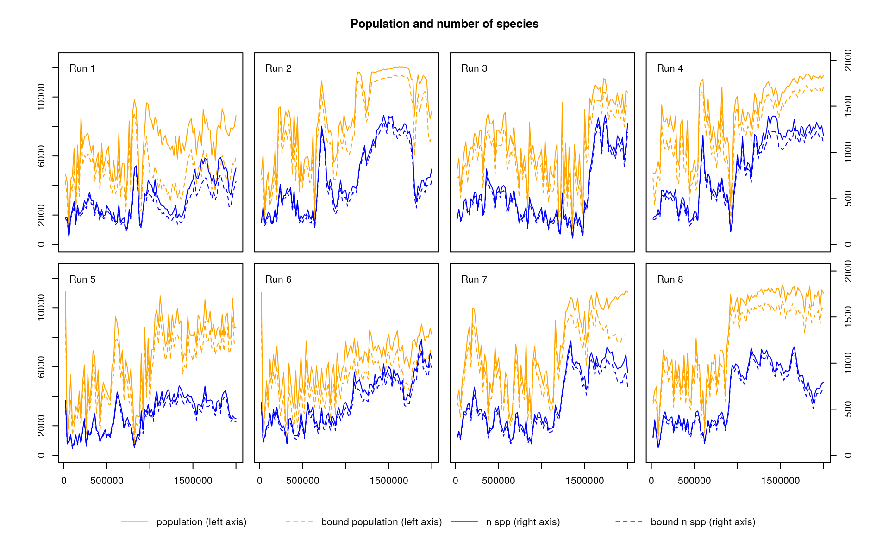
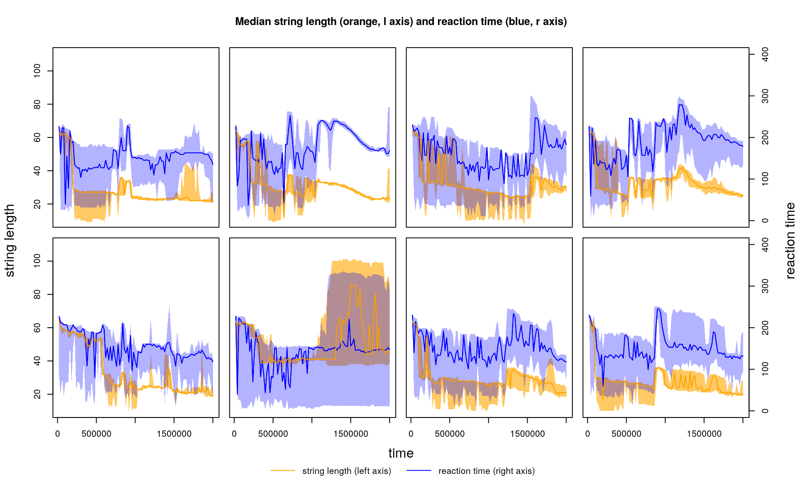
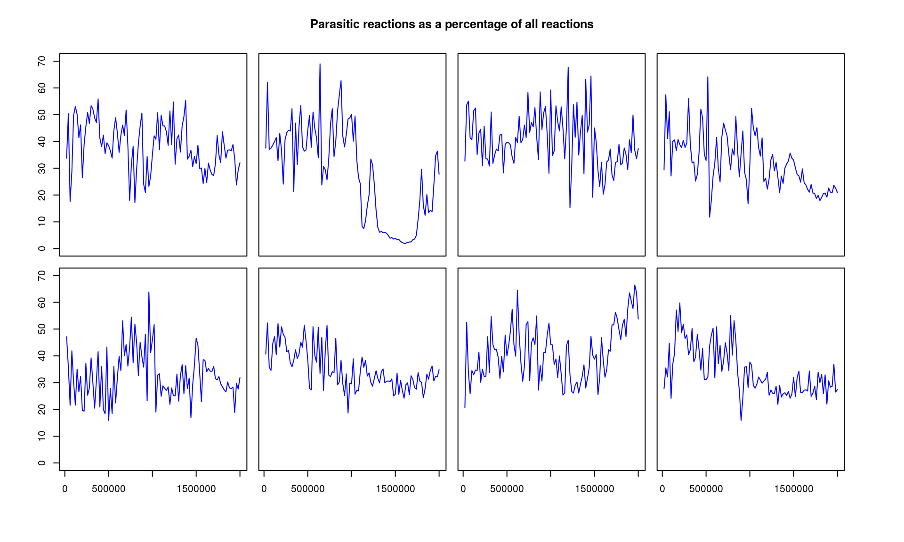
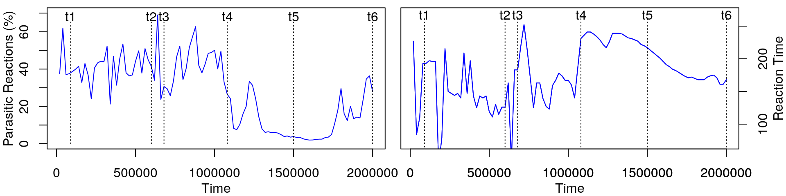
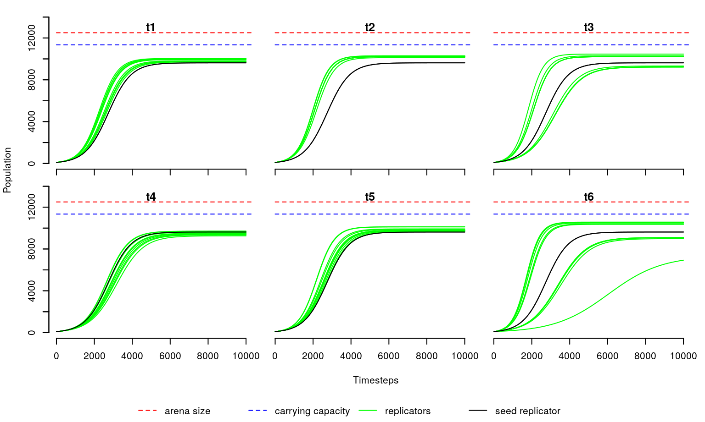
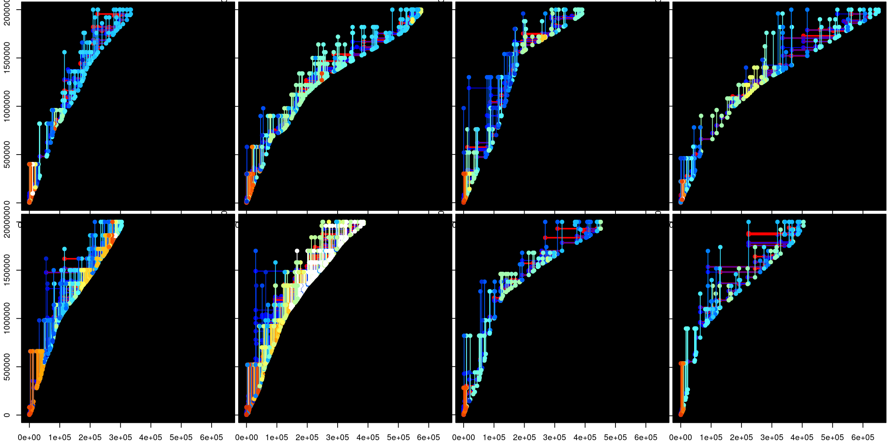

```{r, include = FALSE}
knitr::opts_chunk$set(
  collapse = TRUE,
  comment = "#>"
)
```

## Summary:

This file gives example R code to analyse the raw stringmol data and produce analysis plots. The pdf version of this document shows the graphical outputs that can be generated. The .rmd version of the file can be run in Rstudio to generate the outputs. 

The raw stringmol text file outputs are in the `raw` directory. This data can be parsed into R data objects using the script `makeRdata.R`. This is a lengthy analysis, taking about 6 hours on a modern (2020) laptop. Because of this, we have made the R data objects availible in this archive in the `rdata` directory, but to recreate the datasets, the following Rscript command should be used: 

`Rscript makeRdata.R FULL`

This will generate the rdata objects used, and also some similar graphic in separate pdf files for each run - these can be found in the `rdata/runX` sub directories. 


## Software

Software for generating and interpreting this dataset is available as follows: 

- Stringmol: [https://github.com/uoy-research/stringmol] version 0.2.3.4 runs the artificial chemistry
- Rstringmol: [https://github.com/uoy-research/Rstringmol] version 1.0.0 runs the analysis of the outputs


## Running stringmol 

Configuration files for each of these runs are available in the `script/runX` folder, where `X` is a number from 1 to 8. Assuming the program is to be run in the same folder as the config file, a stringmol run can be started using the following command

`stringmol 33 initrun1.conf`

## Running the analysis

The remainder of this document focuses on generating the graphical outputs seen in the paper. The `.rmd` version of this document will run the code and generate the pdf in RStudio using the `knit` command.  

## Loading the R packages

R packages are loaded as follows:

```{r demoraw,eval=T, include=T,message=F}
require("stringr")
require("Rstringmol")
```

## Loading reaction data

The raw stringmol output logfiles can be parsed into R data objects can be generated using the Rscript command `Rscript makeRdata.R FULL` as described above. The datasets containing the reaction classifications can be loaded as follows: 

```{r load_data, eval=FALSE, include=TRUE}
smsp <- list()

for(rr in 1:8){
  fn <- sprintf("rdata/run%d/rprops%02d.RData",rr,rr)
  load(fn)
  smsp[[rr]]<-rundata
}

```

Global settings for the figures below are: 

```{r config, eval=FALSE, include=TRUE}

require(stringr)
myoma = c(5.5,4.5,4,4.5)
mymar = c(0.5,0.5,0.5,0.5)
lax=c(T,F,F,F,T,F,F,F)
rax=c(F,F,F,T,F,F,F,T)
bax=c(F,F,F,F,T,T,T,T)
cols = c("orange","blue")
```


## Plotting population size and species numbers (including unbound molecules). 

First we load the population data, which includes data for unbound molecules:

```{r truepop,cache=TRUE, eval=FALSE, include=TRUE}
popdata<-list()
for(rr in 1:8)
  popdata[[rr]] <- readRDS(sprintf("rdata/run%d/popdata%02d.RDS",rr,rr))
```


With that to hand, we can look at the full population and the species diversity compared with the 'bound only' numbers we plotted above: 


```{r popfig, fig.height=6, fig.width=10, message = F, warning=FALSE, eval=FALSE, include=TRUE}

par(mfrow=c(2,4),oma=myoma)

for(rr in 1:length(smsp))
  figpopdy(smsp[[rr]],popdata[[rr]],lax[rr],rax[rr],bax[rr],mymar,cols,rr)
title("Population and number of species",outer=T)

# To make a legend add a single empty figure over the whole graphics device, 
# and then put the legend on *that* figure
par(fig = c(0, 1, 0, 1), oma = c(0, 0, 0, 0), mar = c(0, 0, 0, 0), new = TRUE)
plot(0, 0, type = "n", bty = "n", xaxt = "n", yaxt = "n")
legend('bottom',legend=c("population (left axis)",
                         "bound population (left axis)",
                         "n spp (right axis)",
                         "bound n spp (right axis)"),
       col=c(cols[1],cols[1],cols[2],cols[2]), 
       xpd = T, horiz = TRUE,  seg.len=3, 
       bty = 'n',inset=c(0,0),lty=c(1,2,1,2))
```


{width=100%}


## Figure 2: String length and reaction time

Here we plot both string length and reaction time. The central line shows the median value and the shaded region shows the interquartile range. 

```{r figlentime,fig.height=6, fig.width=10, eval=FALSE, include=TRUE}

par(mfrow=c(2,4),oma=myoma)
for(rr in 1:length(smsp))
  figlentime(smsp[[rr]],prop=1,ylim=c(10,110),ylim2 = c(0,400),
             lax[rr],rax[rr],bax[rr],mymar,cols)

title("Median string length (orange, l axis) and reaction time (blue, r axis)",outer=T)

# Legend
par(fig = c(0, 1, 0, 1), oma = c(0, 0, 0, 0), mar = c(0, 0, 0, 0), new = TRUE)
plot(0, 0, type = "n", bty = "n", xaxt = "n", yaxt = "n")
legend('bottom',legend=c("string length (left axis)",
                         "reaction time (right axis)"),
       col=c(cols[1],cols[2]),lty=1, xpd = T, horiz = TRUE,  seg.len=3, 
       bty = 'n',inset=c(0,0))

mtext(text="time",side=1,line=-3,outer=TRUE)
mtext(text="string length",side=2,line=-1.5,outer=TRUE)
mtext(text="reaction time",side=4,line=-1.5,outer=TRUE)
```


{width=100%}


## Replicating vs Parasitic reactions

The dynamics of self-replicators and their parasites can be illustrated by plotting the proportion of parasitic reactions as follows:  

```{r fig.height=6, fig.width=10, eval=FALSE, include=TRUE}
par(mfrow=c(2,4),oma=myoma,mar=c(3,3,0,0))
for(rr in 1:length(smsp))
  figrepvpar(smsp[[rr]],ylim=c(0,70),nsteps=F,lax[rr],rax[rr],bax[rr]
             ,mymar,cols,ratio=T,v2=T)
title(sprintf("Parasitic reactions as a percentage of all reactions"), outer = T)
```


{width=100%}

## Comparing reaction time and parasitic load

The observation that reaction time slows down in the presence of parasites can be illustrated as follows: 

```{r fig.height=2.5, fig.width=10,echo=T,warning=F, eval=FALSE, include=TRUE}

t1 <-  90000
t2 <-  600000
t3 <-  680000
t4 <- 1080000
t4a<- 1240000
t5 <- 1500000
t6 <- 2000000

par(mfrow=c(1,2),oma=c(2.5,2.5,0,2.5))#,oma=c(0,0,0,0))
rr<-2

figrepvpar(smsp[[rr]],ylim=c(0,70),nsteps=F,lax[rr],rax[rr],bax[rr],ratio=T)
axis(1)
axis(2)
yl <- 66
yt <- 68
segments(x0=t1,y0=0,y1=yl,lty=3);text(labels = "t1",x=t1,y=yt)
segments(x0=t2,y0=0,y1=yl,lty=3);text(labels = "t2",x=t2,y=yt)
segments(x0=t3,y0=0,y1=yl,lty=3);text(labels = "t3",x=t3,y=yt)
segments(x0=t4,y0=0,y1=yl,lty=3);text(labels = "t4",x=t4,y=yt)
segments(x0=t5,y0=0,y1=yl,lty=3);text(labels = "t5",x=t5,y=yt)
segments(x0=t6,y0=0,y1=yl,lty=3);text(labels = "t6",x=t6,y=yt)

mtext("Time", side = 1, line = 2, cex = 1)
mtext("Parasitic Reactions (%)", side = 2, line = 2, cex = 1)

figlentime(smsp[[rr]],prop=1,ylim2=c(70,270),lax[rr],rax[rr],bax[rr],mymar,cols,plotlen = F,quartiles = F)
axis(1)
axis(4,)
yl <- 264
yt <- 267
segments(x0=t1,y0=0,y1=yl,lty=3);text(labels = "t1",x=t1,y=yt)
segments(x0=t2,y0=0,y1=yl,lty=3);text(labels = "t2",x=t2,y=yt)
segments(x0=t3,y0=0,y1=yl,lty=3);text(labels = "t3",x=t3,y=yt)
segments(x0=t4,y0=0,y1=yl,lty=3);text(labels = "t4",x=t4,y=yt)
segments(x0=t5,y0=0,y1=yl,lty=3);text(labels = "t5",x=t5,y=yt)
segments(x0=t6,y0=0,y1=yl,lty=3);text(labels = "t6",x=t6,y=yt)

mtext("Time", side = 1, line = 2, cex = 1)
mtext("Reaction Time", side = 4, line = 2, cex = 1)
```


{width=100%}

## Figure 5: Capacity plots for well-mixed systems

Here we take the 10 most common self-replicating reactions and calculate the time to reach carrying capacity in a well-mixed system. 


```{r ccplots,fig.height=4.8, fig.width=8, results='hide',message=FALSE,warning=FALSE, eval=FALSE, include=TRUE}
rundata = smsp[[2]]
par(mfrow=c(2,3),oma=c(7,4,0,0)+0.1, mar = c(0,0,1,1) + 0.1)

ccplot(dts(90000,rundata),title="t1",doy=T)
ccplot(dts(600000,rundata),title="t2")
ccplot(dts(680000,rundata),title="t3")
ccplot(dts(1080000,rundata),title="t4",dox=T,doy=T)
ccplot(dts(1500000,rundata),title="t5",dox=T)
ccplot(dts(2000000,rundata),title="t6",dox=T)

title(xlab = "Timesteps",
      ylab = "Population",
      outer = TRUE, line = 3)

# Legend
par(fig = c(0, 1, 0, 1), oma = c(0, 0, 0, 0), mar = c(0, 0, 0, 0), new = TRUE)
plot(0, 0, type = "n", bty = "n", xaxt = "n", yaxt = "n")
legend("bottom",horiz=T,border = 'n',
       legend=c("arena size","carrying capacity","replicators","seed replicator")
       ,lty=c(2,2,1,1),col=c("red","blue","green","black"),bty="n")
```


{width=100%}


## Figure 7: Phylogeny plots

The main paper describes a phylogeny for run 2. Here we generate the same for each run: 

```{r plotpyl, fig.height=6, fig.width=12,echo=T,eval=T,message=F, eval=FALSE, include=TRUE}
par(mfrow=c(2,4))
library(png)
imnos<- c(t1,t2,t3,t4,t5,t6)
par(mar=c(0.2,0.2,0.2,0.2),oma=c(2,2,0,0))

mxl <- c(0,650000)

for(rr in 1:8){
  phyl<-readRDS(sprintf("rdata/run%d/phyldata%02d.RDS",rr,rr))
  if(rr==5){
    # SPECIAL CASE: We have to set trace<-F for one extra molecule 
    # because it wasn't recorded properly in the logfiles: 
    phyl$trace[phyl$idx==285937]<-F
  }
  plotphyl(phyl[phyl$trace & !is.na(phyl$idx),],xlim=mxl)
}

```


{width=100%}

## Appendix:

Finally, here is a summary of the original run names on the YARCC cluster for reference:

- run1 (box-box1):  `smsp/1705smsp/out1`
- run2 (box-box2):  `smsp/1705smsp/out2`
- run3 (box-box3):  `smsp/1705smsp/out3`
- run4 (box-box5):  `smsp/1705smsp/out5`
- run5 (box-rand2): `smsp/1705smspr/out2`
- run6 (box-rand3): `smsp/1705smspr/out3`
- run7 (slot-box4): `smsp/1705sm250/out4`
- run8 (slot-box5): `smsp/1705sm250/out5`
